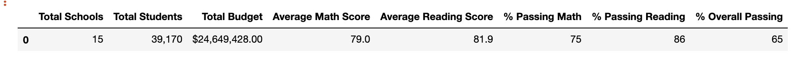
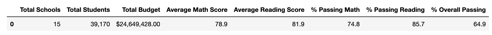
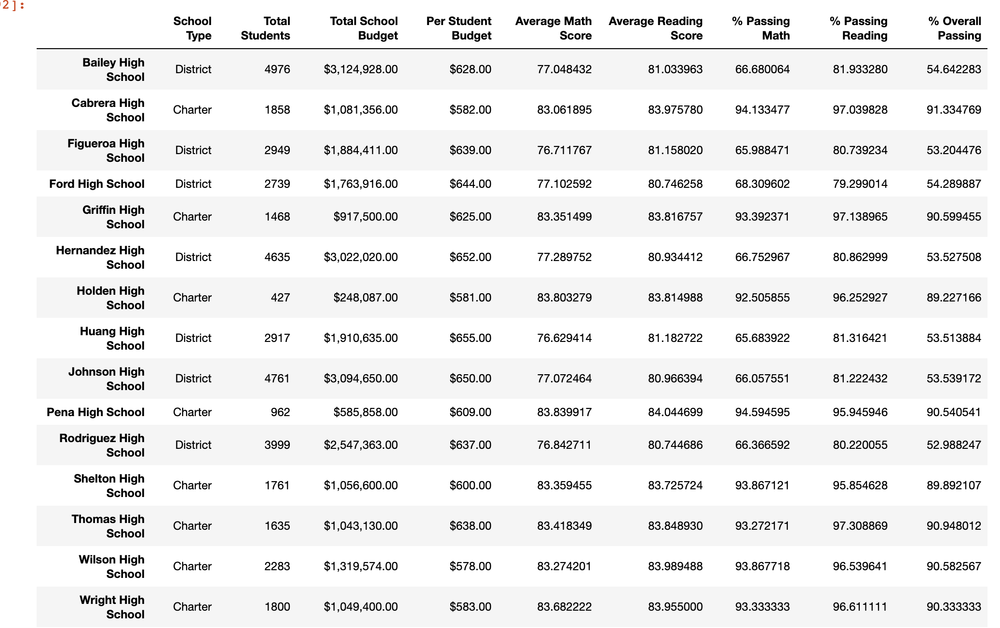
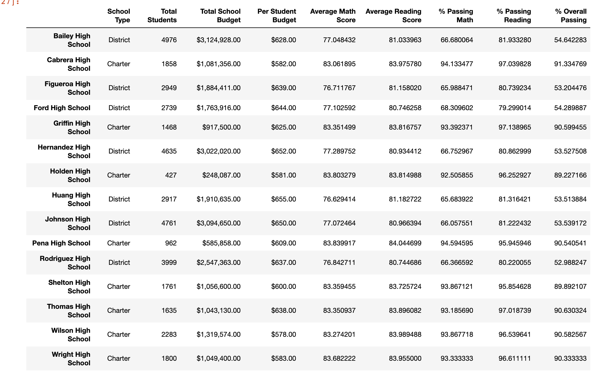

# school_district_analysis
Module 4

## Overview
The purpose of this Challenge is to update the school data to exclude scores impacted by academic dishonesty and to determine how these changes impact the overall analysis.

## Results
**ORIGINAL DISTRICT SUMMARY**

**UPDATED DISTRICT SUMMARY**

**ORIGINAL PER SCHOOL SUMMARY**

**UPDATED PER SCHOOL SUMMARY**

- How is the district summary affected?
  - The percentage of students passing math decreased by 0.2%
  - The percentage of students passing reading decresed by 0.3%
  - The percentage of students passing overall decreased by 0.1%
- How is the school summary affected?
  -  Average math score decreased 0.07 points
  -  Average reading score increased 0.05 points
  -  Percent passing math decreased 0.08%
  -  Percent passing reading decreased 0.29%
  -  Percentage passing overall decreased 0.32%
- How does replacing the ninth graders’ math and reading scores affect Thomas High School’s performance relative to the other schools?
  -  Thomas Highschool remains the second best performing school within the disctrict, even after the changes.
- How does replacing the ninth-grade scores affect the following:
  - Math and reading scores by grade
    -  The math and reading scores for Thomas High School 9th graders have been removed, however the average scores for the other grade levels remain unchanges.
  - Scores by school spending
    - The average scores by school spending have not changed as a result of removing the scores for Thomas High Scool 9th graders.
  - Scores by school size
    - The average scores by school size have not changed as a result of removing the scores for Thomas High Scool 9th graders.
  - Scores by school type
    - The average scores by school type have not changed as a result of removing the scores for Thomas High Scool 9th graders.

## Summary: 
Summarize four changes in the updated school district analysis after reading and math scores for the ninth grade at Thomas High School have been replaced with NaNs.
1. The percentage of students within the district who are passing their classes decreased as a result of replacing the Thomas High School ninth graders' scores.
2. The average math score across the district decreased by 0.1 points. 
3. The percentage of Thomas High School student who are passing their classes decreased as a result of replacing the 9th graders' scores.
4. The average math score at Thomas High School decreased by 0.07 points as a result of replacing the 9th graders' scores.
